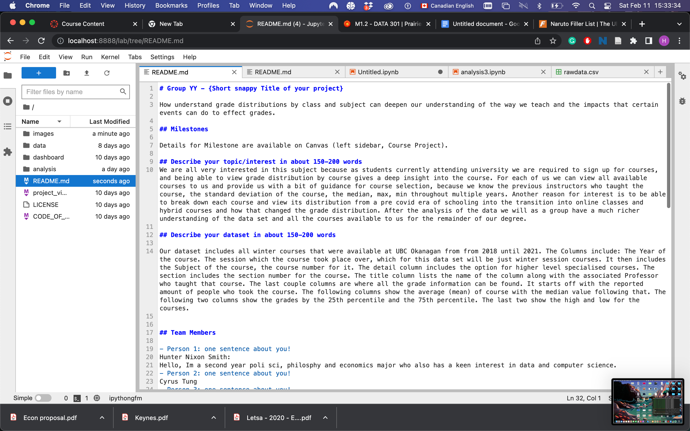

# Group YY - {Short snappy Title of your project}

How understand grade distributions by class and subject can deepen our understanding of the way we teach and the impacts that certain events can do to effect grades. 

## Milestones

Details for Milestone are available on Canvas (left sidebar, Course Project).

## Describe your topic/interest in about 150-200 words
We are all very interested in this subject because as students currently attending university we are required to sign up for courses, and being able to view grade distribution by course gives a deep insight into the course. For each of us we can view all available courses to us and provide us with a bit of guidance for course selection, because we know the previous instructors who taught the course, the standard deviation of the course, the median, max, min throughout multiple years. Another reason for interest is to be able to break down each course and view its distribution from a pre covid era of schooling into the transition into online classes and hybrid courses and how that changed the grade distribution. After the analysis of the data we will as a group have a much richer understanding of the data set and all the courses available to us for the remainder of our degree. We also include data from UBCV to act as a most similar comparison which can help us view and analyze if there is any statistical abnormalities this can help us find that. 

## Describe your dataset in about 150-200 words

Our dataset includes all winter courses that were available at UBC Okanagan and Vancouver Campus from from 2018 until 2021. The Columns include: The Year of the course. The session which the course took place over, which for this data set will be just winter session courses. It then includes the Subject of the course, the course number for it. The detail column includes the option for higher level specialised courses. The section includes the section number for the course. The title column lists the name of the column along with the associated Professor who taught that course. The last couple columns are where all the grade information can be found. It starts off with the reported amount of people who took the course. The following columns show the average (mean) of course with the median value following that. The following two columns show the grades by the 25th percentile and the 75th percentile. The last two show the high and low for the courses. By having two different university campuses available with both of them being within the same reigon thus elimates some factors that can occur when comparing two universites that are is vastly different geographical reigons.

## Team Members

- Person 1: one sentence about you!
Hunter Nixon Smith: 
Hello, Im a second year poli sci, philosphy and economics major who also has a keen interest in data and computer science. 
- Person 2: one sentence about you!
Cyrus Tung
- Person 3: one sentence about you!
Noah Chan
Hi, I am an international student from Hong Kong. Im in second year and willing to major in computer science.
## Images

{You should use this area to add a screenshot of an interesting plot, or of your dashboard}

## References

{Add your stuff here}

