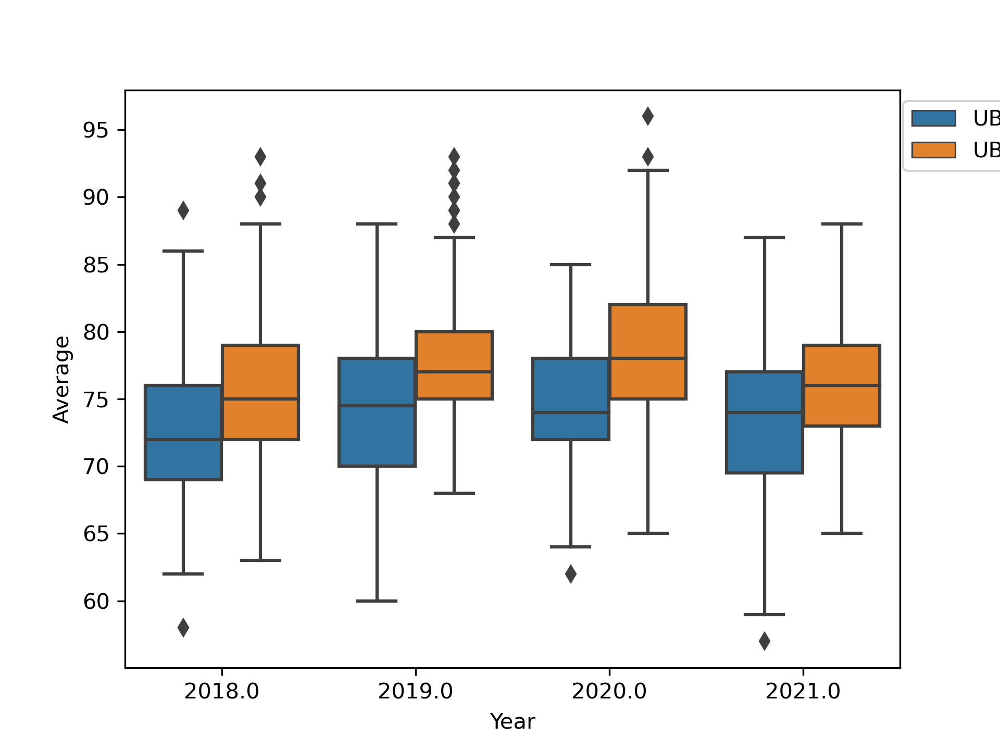
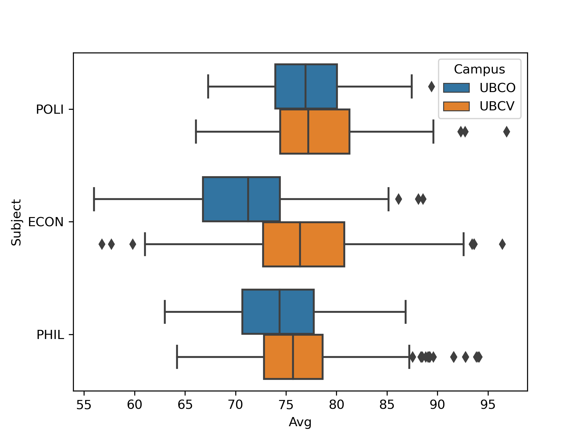

### Introduction 
##### In this project, we explore the impact of the COVID-19 pandemic on academic performance by examining grade distribution, mean grades, and changes in class sizes across various types of courses. We investigate the shift from traditional in-person learning to online and hybrid classes during the pandemic and then into 2021, where a blend of hybrid, online, and in-person courses emerged. Our primary research interest lies in understanding how remote and hybrid learning has affected students' academic performance in various subjects. Upon completion of this project, we aim to shed light on the challenges and benefits that remote and hybrid learning may present for both students and instructors, thereby offering valuable insights for educational institutions navigating the ever-evolving landscape of teaching and learning.

#### EDA
#### Our EDA focused around the change in Grades that occrued from 2018 to 2021.
###### This graphs breaksdown the grade average over the the campus from the years of 2018 to 2021. As a first graph this provides with a basic breadown and overall idea of what to expect form more in depthful analysis. 

##### The second graph used in the EDA, is more depthful breakdown of the grades from UBCO and UBCV. It is a box plot showing the breakdown seperating the two campuses across the years. In this we can see an upward trend form 2018 to 2020, with grades increasing on average across the campuses. It then drops down in average in 2021 at both campsues. 

##### The third graph used in My EDA is a line plot. In this lineplot we seperate every subject by its associated campus and the plot it on the graph. As we can see from the graph there is a similar upward trend across all subject from 2018 to 2020. With then a drop in average across all subejct in 2021. This correlation analysis, is consistent with out preceptions of online learning. After experiancing online learning, I ahd thougth that this may be the case, and as well transitiioning back to in person leanring was very dificult for many people, esspcially people who had become used to learning online and not being in social environments. 

##### The last graph used in my EDA is a horrizontal box plot that shows the averages from the three subjects put next to its counter part over the 4 years. And it shows the outliars in each catagory. Being able to visualzie any outliars is very useful for when analayszing data because it allows you to know how consistent your data is and the level on confidence you can have when analyzing it. 

## link to our analysis View the detailed analysis in our Jupyter Notebook (http://localhost:8889/lab/tree/analysis/analysis1.ipynb
## link to our analysis View the detailed analysis in our Jupyter Notebook http://localhost:8889/lab/tree/analysis/analysis2.ipynb

### NOAH CHAN 
##### By examining the graph of the average grades of the two campuses over time, we can observe that both campuses experienced a significant increase in grades in 2020, followed by a decrease in 2021. This pattern suggests that the impact of online learning on student performance was consistent across both campuses. This finding is important because it suggests that the results of our analysis could be applicable to other institutions that have implemented online learning as a result of the COVID-19 pandemic as the consistency was shown.

##### This shows the average grades of students in ECON, PHIL, and POLI over time, provides additional insights into the impact of online learning on student performance in specific academic disciplines. The graph shows that all three subjects had a higher average in 2020, which suggests that these courses may have benefited from online learning (at least in the short term). 

##### This box plot provides additional insights beyond just the average grade by showing the distribution of grades within each subject and campus. Comparing the box plots of different subjects or campuses suggests that online learning may have helped students to reach their highest potential grades. However, in 2021, when classes returned to normal or a hybrid online/in-person format, the lowest grades were also achieved, indicating that the effectiveness of online learning may be affected by the mode of instruction.

### Question 1 + Answer 1
##### For my EDA: I chose the question What effects can we visualize from the transition of in-person to online/hybrid then back to inperson/hybrid courses during the COVID-19 pandemic impact the grade distribution of individual courses? 

##### Overall my findings suggest that the shift to online/hybrid learning coincided with an increase in average grades from 2018 to 2020 at both campuses, with a drop in 2021 when in-person/hybrid courses resumed. This suggests that online/hybrid learning might have had a positive impact on students' academic performance during that period. Although the impact was not uniform across campuses, subjects, or grade ranges, our analysis provides useful correlational evidence to understand the effects of online learning on students' academic performance.

### Question 3 + Answer 3
##### For my EDA: What is the impact of changes in course format (e.g., online, in-person, hybrid) on student course selection and academic performance in higher education?

#### Based on thevisualizations, I can conclude that online learning had a positive impact on student performance in the short term. I observed a significant increase in grades across different academic disciplines and campuses when online learning was implemented. However, I also observed a decrease in grades when classes returned to normal or a hybrid online/in-person format. This suggests that the effectiveness of online learning may be affected by the mode of instruction.

### Summary:

##### During the course of this project, we have learned a great deal from the data we have analyzed. From our analysis it does appear that there was a decrease in performace from online learning to hybrid/in person classes. The scope of this project, however is unable to pinpoint the exact cause(s). To acheive conclusion resutls of the cause the of the change in grades would require a much more complex analysis and require the conduction of your own data, research, and studies. This EDA, did however allow give us a broad analysis of the effects the precarious past couple years has had on academic performance.

